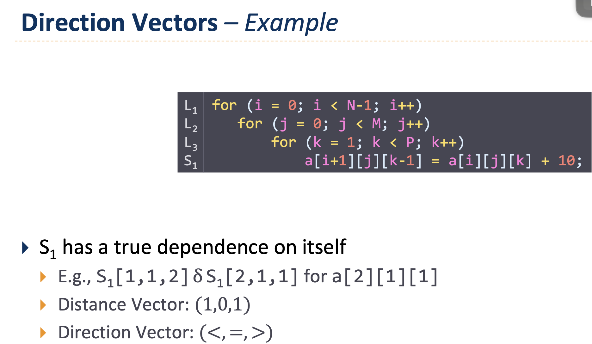

Manually:       Yes, if x and y do not overlap
By compiler:    Only if aliasing can be ruled out (e.g., with restrict)

3.
S1 has a true dependence on itself
E.g., S1[1,1,2] δ S1[2,1,1] for a[2][1][1]
Distance Vector: 1,0,-1
Direction Vector: < , = , >

Iteration 1: i = 1, j = 1, k = 2
➤ liest a[1][1][2], schreibt in a[2][1][1]
Iteration 2: i = 2, j = 1, k = 1
➤ liest a[2][1][1]
➡️ Lesen in Iteration 2 nutzt Wert, der in Iteration 1 geschrieben wurde → echte Datenabhängigkeit

nur j schleife ist parallelisierbar
 selbes problem wie in VO